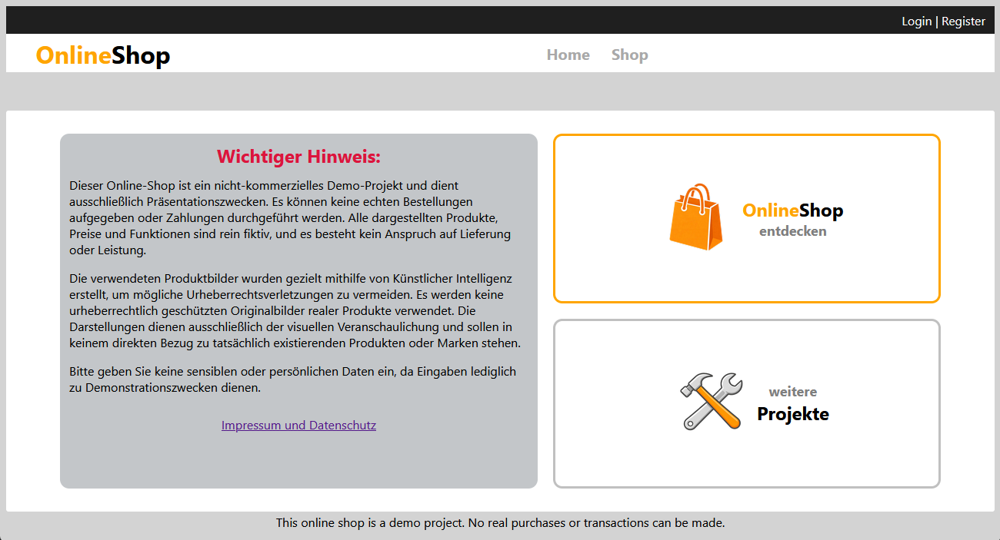
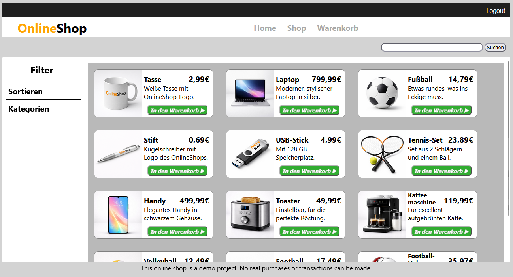
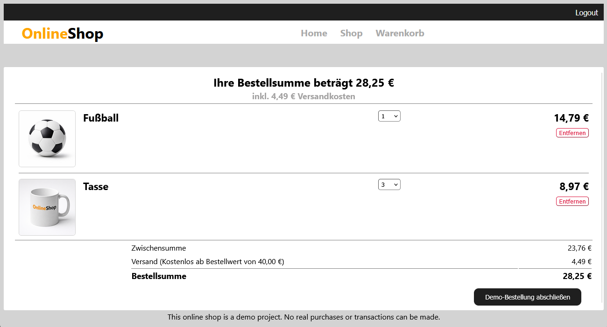

# OnlineShop-Demo with Node.js/Express
Note: The UI of this project is currently only available in german  
This project is a locally executable demo of a simple online shop, built for learning and demonstration purposes.
The goal of this project is to showcase basic shop functionality including account creation without using an external database or backend hosting.

# Features
- Product listing
- Account creation and login
- Shopping cart functionality
- Add/ remove Items
- Simulated checkout
- Data handled entirely in local memory (no database)

# Technical Approach
- Build with Node.js/Express
- Data stored only in local memory (objects and arrays)
- No persistend storage
- No external API integration
- All data is automatically deleted when the application is closed

# Installation and Run
Requirements:  
  Node.js is installed (check with node --version in the terminal)    
Steps:
  - Clone repository:  
  git clone https://github.com/Krobi23/OnlineShop-Demo
  - Navigate into project folder:  
  cd OnlineShop-Demo
  - Install required npm-packages:  
  npm install express  
  npm install express-sessions  
  npm install ejs  
  - Start application:  
  node app.js
  - Open the shown link into your browser:  
  http://localhost:8020
  - To close the local web-server type in the terminal:  
  ctrl + C

# Preview
Homepage of this Website (Login/Register-options availabe in the top-right corner):

Shop-page (Add to cart buttons become only available after login):

Cart-page (This page entirely becomes only available after login):

# Note
This project is not a production-ready online shop. It is intended soloey as:
- a lerning project
- a demonstration of basic webshop funtionality
- part of my developer portfolio

# Privacy
  - No storage of personal data
  - No data transmission to external servers
  - All processing happens locally

For more details, see the privacy policy (Datenschutzerklärung) included in this project
